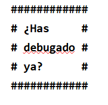

# kata-words-frame

 Crea una función que reciba un texto y muestre cada palabra en una *línea,
 formando un marco rectangular de *almohadillas("#").

 **Input**  
 ¿Has debugado ya?

 **Output**

   
**Bonus track: Haz lo mismo pero enmarcando con el símbolo de Batman**

Aquest exercici està basat en [Retos de Programación de Mouredev](https://retosdeprogramacion.com/ejercicios). Concretament el #31 de 2022.